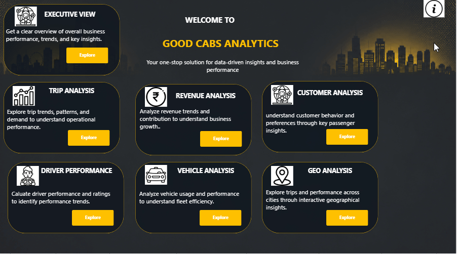
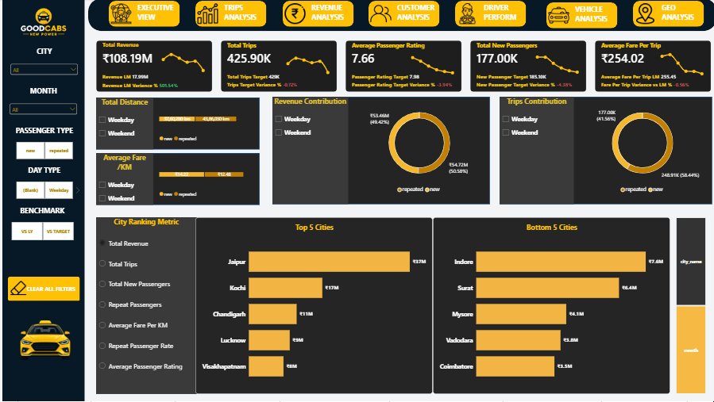
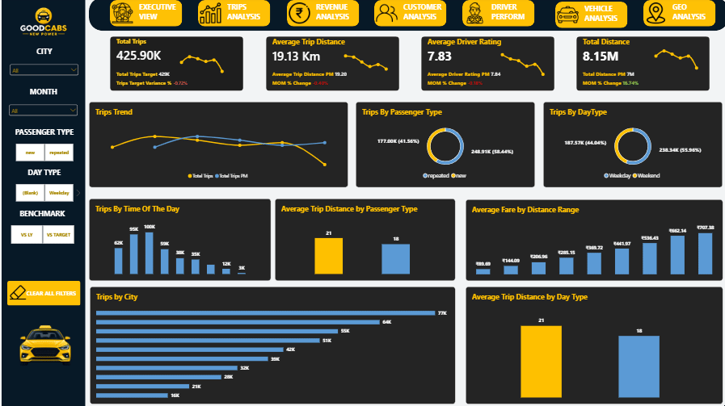
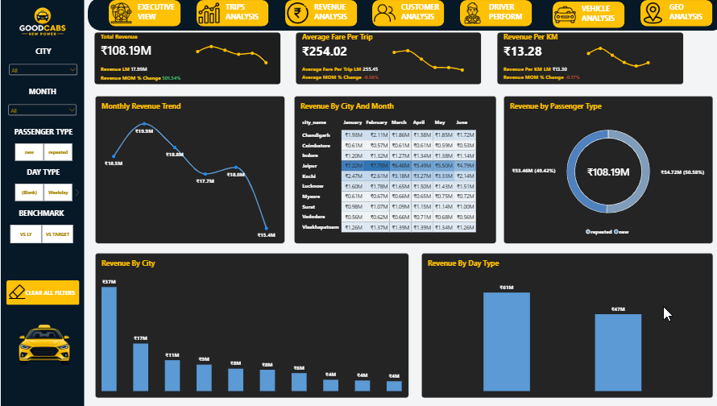
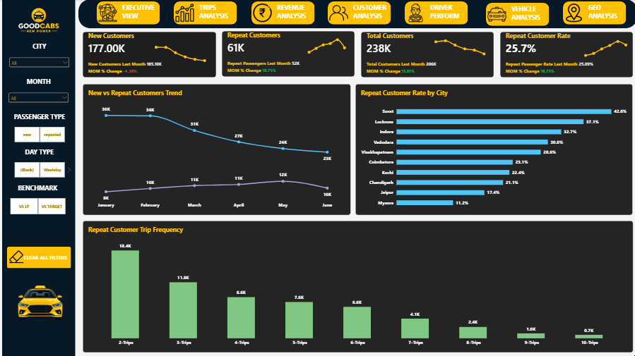
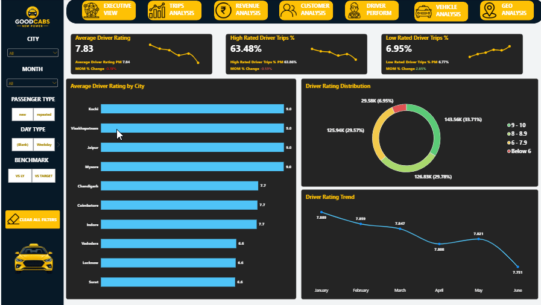
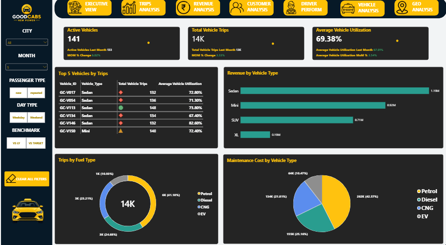
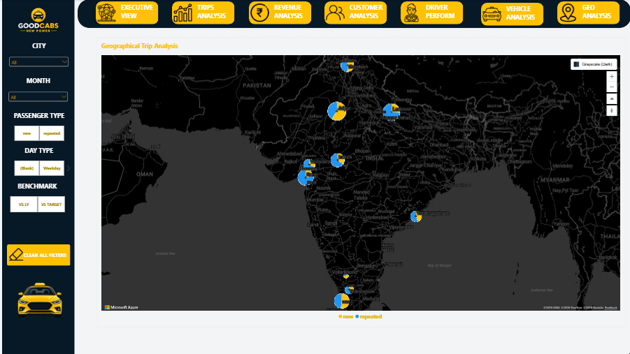

  

# 🚕 GoodCabs — Power BI Business Intelligence Dashboard

  <b>Turning Mobility Data into Meaningful Business Insights</b>

---

## 📊 Project Overview

GoodCabs is a mobility and cab service business operating across multiple cities. The business generates large volumes of data across trips, revenue, passengers, drivers, vehicles, and geographic performance.

This project transforms that operational data into an **interactive Power BI Business Intelligence dashboard** designed to provide a comprehensive view of business performance and help stakeholders make data-driven decisions.

The dashboard brings together multiple analytical perspectives, allowing users to move from a high-level executive overview to detailed analysis of trips, revenue, customers, drivers, vehicles, and geographic performance.

---

## 🎯 Business Objective

The primary objective of this project is to help GoodCabs management:

- Monitor overall business performance
- Understand trip and revenue trends
- Analyze customer behavior and retention
- Evaluate driver and vehicle performance
- Compare performance across cities
- Identify areas of strong and weak performance
- Understand operational patterns
- Support data-driven business decisions

---

# 🏠 Home

The **Home page** serves as the central navigation point for the GoodCabs analytics solution.

It provides a clean and intuitive entry point to the dashboard, allowing users to easily navigate between the different analytical sections.

The navigation is designed to make the dashboard simple to explore while keeping the overall experience consistent across all pages.

---

# 📈 Executive View

The **Executive View** provides a high-level summary of GoodCabs' overall business performance.

This page is designed for management and decision-makers who need a quick understanding of the current business situation without going through detailed operational analysis.

The executive dashboard brings together important business KPIs and performance indicators to provide a concise view of:

- Overall business performance
- Trip performance
- Revenue performance
- Passenger performance
- Customer experience
- Key trends
- Performance across business segments

This page acts as the starting point for understanding **what is happening across the business** and identifying areas that require deeper investigation.

---

# 🚕 Trip Analysis

The **Trip Analysis** page focuses on understanding trip activity and operational demand across the GoodCabs business.

Trips are one of the most important indicators of demand and operational performance in a mobility business.

This page helps analyze:

- Total trip performance
- Trip trends
- Trip distribution
- Trip patterns
- Performance across different segments
- Changes in demand over time
- Operational performance indicators

The analysis provides a clearer understanding of how trip activity changes and where potential operational opportunities may exist.

---

# 💰 Revenue Analysis

The **Revenue Analysis** page focuses on understanding GoodCabs' revenue performance and the factors contributing to it.

Revenue is analyzed across different dimensions to understand business performance, trends, and contribution.

This page helps stakeholders explore:

- Revenue performance
- Revenue trends
- Revenue contribution
- Revenue distribution
- Performance across cities
- Changes in revenue over time
- Relationship between trips and revenue

By analyzing revenue alongside operational metrics, stakeholders can better understand where the business is generating value and where growth opportunities may exist.

---

# 👥 Customer Analysis

The **Customer Analysis** page focuses on understanding passenger behavior and customer engagement.

Customer retention and repeat usage are important indicators for a mobility business because they help evaluate the strength of the customer relationship.

This analysis provides insights into:

- Customer behavior
- New and repeat passengers
- Repeat passenger performance
- Passenger activity
- Customer contribution
- Customer trends
- Opportunities for improving customer retention

The analysis helps GoodCabs understand its customer base and identify opportunities to encourage stronger and more consistent repeat usage.

---

# 👨‍✈️ Driver Performance

The **Driver Performance** page focuses on analyzing driver-related activity and operational contribution.

Drivers are a critical part of the GoodCabs service ecosystem, making driver performance an important component of overall business operations.

This page helps stakeholders understand:

- Driver performance
- Driver activity
- Operational contribution
- Performance patterns
- Differences in driver performance
- Areas for potential operational improvement

The analysis helps connect driver-level performance with the broader operational health of the business.

---

# 🚗 Vehicle Analysis

The **Vehicle Analysis** page focuses on understanding vehicle-related performance within GoodCabs operations.

Fleet efficiency is an important factor in a mobility business because vehicle availability and utilization directly influence the ability to serve customer demand.

This page helps analyze:

- Vehicle performance
- Vehicle distribution
- Operational contribution
- Vehicle-level trends
- Performance differences
- Fleet-related patterns

The analysis provides a better understanding of how the vehicle fleet supports GoodCabs' operational performance and where efficiency improvements may be possible.

---

# 🌍 Geo Analysis

The **Geo Analysis** page provides a geographic perspective of GoodCabs' business performance.

City-level analysis is particularly important because overall business performance can hide significant differences between individual markets.

This page helps stakeholders compare:

- City-level performance
- Trip activity
- Revenue contribution
- Passenger behavior
- Operational performance
- Geographic trends
- Strong and weak-performing markets

The geographic view helps management identify which locations are contributing strongly to the business and which markets may require additional attention.

---

# ℹ️ Info

The **Info page** provides additional context about the dashboard and explains the purpose, scope, objectives, insights, and interaction capabilities of the GoodCabs analytics solution.

### PURPOSE

This dashboard provides a comprehensive view of GoodCabs operations, helping users explore business performance, trends, and operational insights.

### DATA SCOPE

The report brings together operational and business data covering trips, revenue, passengers, drivers, vehicles, and city-level performance.

### BUSINESS OBJECTIVE

The dashboard is designed to help management monitor performance, identify trends, compare business segments, and uncover opportunities for operational improvement.

### KEY INSIGHTS

The analysis enables decision-makers to understand what is happening across the business, where performance is strongest or weakest, and which areas may require further attention.

### DATA INTERACTION

All analysis pages are interactive. Users can apply available filters and select visual elements to explore trends, comparisons, and underlying business patterns.

---

# 🔍 Key Business Questions

The dashboard was developed to answer practical business questions across different areas of GoodCabs.

### Overall Performance
- How is GoodCabs performing overall?
- What are the key business KPIs?
- How is business performance changing over time?

### Trips
- How is trip demand changing?
- What patterns can be identified in trip activity?
- Which areas require operational attention?

### Revenue
- How is revenue performing?
- Which areas contribute most to revenue?
- What trends can be observed over time?

### Customers
- How are customers behaving?
- What is the level of repeat passenger activity?
- Where are opportunities to improve customer retention?

### Drivers
- How are drivers performing?
- What patterns can be observed in driver activity?
- Where can operational performance be improved?

### Vehicles
- How is the vehicle fleet performing?
- What vehicle-related patterns can be identified?
- Where can fleet efficiency potentially be improved?

### Geography
- Which cities are performing strongly?
- Which cities are underperforming?
- How does performance vary across locations?

---

# 💡 Business Insights

The dashboard provides a framework for identifying meaningful patterns across GoodCabs' business.

### 🏙️ City-Level Differences

Business performance can vary significantly across locations. Geographic analysis helps identify markets that are performing strongly as well as locations that may require targeted strategies.

### 🚕 Trip Performance

Trip activity provides an important indicator of demand and operational performance. Monitoring trip trends can help GoodCabs understand changes in customer demand and operational requirements.

### 💰 Revenue Performance

Revenue analysis helps identify where business value is being generated and allows stakeholders to compare revenue performance across different business dimensions.

### 👥 Customer Retention

Repeat passenger behavior provides an important indicator of customer engagement. Improving customer retention can support more sustainable long-term growth.

### 👨‍✈️ Driver Performance

Driver activity and performance influence service quality and operational efficiency. Monitoring driver performance can help identify opportunities for improvement.

### 🚗 Fleet Efficiency

Understanding vehicle performance and utilization can help GoodCabs make better operational decisions around fleet management.

---

# 🚀 Business Recommendations

Based on the analytical framework, GoodCabs can consider the following strategies:

### 1. Focus on Underperforming Markets

Identify cities or business segments that consistently show weaker performance and investigate the underlying causes.

### 2. Strengthen Customer Retention

Use customer behavior insights to develop initiatives that encourage repeat usage and build stronger customer relationships.

### 3. Improve Fleet Utilization

Analyze demand and vehicle performance together to optimize fleet allocation and improve operational efficiency.

### 4. Monitor Driver Performance

Use driver-level insights to identify performance gaps and opportunities for improving service consistency.

### 5. Track Revenue and Trip Performance Together

Analyzing revenue alongside trip activity provides a more complete understanding of business performance and growth opportunities.

### 6. Replicate Successful Strategies

High-performing cities and segments can be studied to identify successful practices that may be applicable to other markets.

---

# 🧮 Data Preparation & Modeling

The project follows an end-to-end Business Intelligence workflow:

**Raw Data → Data Cleaning → Transformation → Data Modeling → DAX → Visualization → Analysis → Insights**

Power Query was used for data preparation and transformation, including:

- Data cleaning
- Data type corrections
- Data transformation
- Column standardization
- Data quality checks
- Creation of analytical attributes
- Preparing tables for analysis

A structured Power BI data model was then developed to support interactive analysis across the different business dimensions.

---

# 📐 DAX & Analytical Measures

DAX was used to create reusable measures and analytical calculations for the dashboard.

The measures support analysis across areas such as:

- Business KPIs
- Trip performance
- Revenue analysis
- Passenger metrics
- Driver performance
- Vehicle performance
- Geographic analysis
- Trend analysis
- Performance comparisons
- Percentage calculations

The use of reusable measures helps maintain consistency across the dashboard and enables dynamic calculations when users interact with filters and visuals.

---

# 🎨 Dashboard Design

The dashboard was designed with a strong focus on **clarity, consistency, and business usability**.

Key design principles include:

- Clean and structured layouts
- Consistent visual hierarchy
- KPI-focused reporting
- Interactive filtering
- Intuitive navigation
- Consistent typography
- Meaningful visual selection
- Minimal visual clutter
- Business-focused storytelling

The goal was to create a dashboard that allows stakeholders to move from **high-level performance to detailed analysis** without losing context.

---

# 🛠️ Tools & Technologies

**Power BI** — Dashboard development and visualization  
**DAX** — Measures and analytical calculations  
**Power Query** — Data cleaning and transformation  
**SQL** — Data querying and analysis  
**Excel** — Data inspection and validation  
**ShareX** — Dashboard demonstration GIFs

---

# 📚 Key Learning Outcomes

This project strengthened my practical understanding of:

- Business Intelligence
- Power BI development
- Data cleaning and transformation
- Data modeling
- DAX
- KPI development
- Revenue analysis
- Customer analytics
- Operational analytics
- Driver performance analysis
- Vehicle analysis
- Geographic analysis
- Interactive dashboard design
- Business storytelling
- Data-driven decision making

Most importantly, this project helped me practice the complete process of transforming **raw operational data into an interactive decision-support solution.**

---

# 🏁 Conclusion

The GoodCabs Power BI project demonstrates how operational and business data can be transformed into a comprehensive Business Intelligence solution.

By combining **Executive, Trip, Revenue, Customer, Driver, Vehicle, and Geographic analysis**, the dashboard provides stakeholders with a holistic view of GoodCabs' business performance.

The project goes beyond simply presenting numbers. It focuses on understanding **what is happening, where performance differs, what areas require attention, and where opportunities for improvement may exist.**

> **Turn Data into Insights.  
> Turn Insights into Action.  
> Drive Better Business Decisions.**

---

  🚕 <b>GoodCabs | Power BI Business Intelligence</b> 📊

  <i>Turning Data into Destinations</i>

---

---

## 🙏 Acknowledgements

A special thanks to **Codebasics**, **Dhaval Patel**, and **Hemanand Vadivel** for providing the learning resources, guidance, and project inspiration that helped me strengthen my practical skills in **Power BI, data analytics, business intelligence, and data-driven problem solving**.

This project has been an excellent opportunity to apply those learnings to an end-to-end business analytics case study and further develop my skills in building interactive dashboards and translating data into meaningful business insights.

---

## 🔗 Connect With Me

If you found this project interesting, feel free to connect with me or explore more of my work.

**LinkedIn:** (www.linkedin.com/in/mlakshmisujatha)

**Portfolio:**(https://codebasics.io/portfolio/Makam-Lakshmi-Sujatha)

---

  <b>Thank you for exploring my GoodCabs Power BI project! 🚕📊</b>

